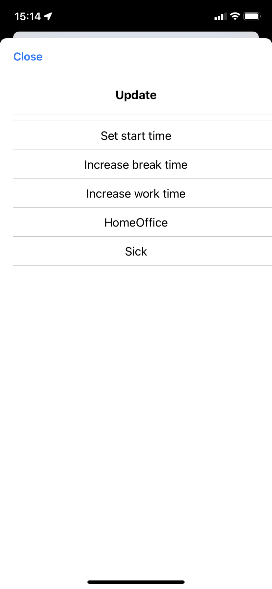

# :brain::clock1: working-hours-widget

This project provides a widget that tracks your working hours (`working-hours-tracker.js`). It also supports a csv-export of your monthly working hours (`working-hours-export.js`).

## Widget Design

The widget for tracking your working hours is divided into three parts.

The top part displays statistics about the current month, the current week and the past five working days: 
The first line displays the current month, the hours you worked (1st number) and the total hours you need to work (2nd number) during this month. 
The second line displays the current week and the hours you worked during this week. 
The third line displays your average daily working hours calculated over the last five working days.

The middle part displays today's day and date.

And the bottom part shows information about the current working day. This information is only shown for working days. If the current day is a weekend, holiday or vacation, no data is shown.
Otherwise, the start time, break duration and finish time are, once provided, displayed in the first line. In the second/last line the current working hours are displayed. These are calculated based on the provided data. The current working hours are calculated once a start time is provided. If no finish time is provided, the current time is used to calculate the current working hours. Once a break duration is provided, it is subtracted from the current working hours.

The monthly, average daily and current working hours are color coded:
* Blue indicates that you reached or exceeded your needed working hours
* Orange indicates that you worked less than your needed working hours (not used for monthly working hours)

See the config parameter `honestDayWork` in [Tracker Config Parameter](https://github.com/jkling2/working-hours-widget#tracker-1) for setting your individual needed daily working hours. 

## Functionality

### Tracker

The working hours tracker tracks your daily working hours as precise as 15 minutes. A start/finish time or break duration that is not as precise as 15 minutes is rounded down to either the previous full quarter hour or the next smaller multiple of 15 (minutes).

Data about your daily working hours can be tracked in two different ways.

#### Via Notifications

For each day three interactable notifications are scheduled and send at the provided notification times.
See the config parameters `startOfDayNotifTime`, `breakOfDayNotifTime`, `endOfDayNotifTime` in [Tracker Config Parameter](https://github.com/jkling2/working-hours-widget#tracker-1) for setting your individual notification times.

You can either long-press or click the notification to provide either your start time, break duration or finish time, depending on the notification you are interacting with.
The resulting UIs (via long-press or click) are identical. Furthermore, the structure of the UIs for providing either your start time, break duration or finish time are identical. A header informs you about the data you are changing. After that a few options are provided. Or you can enter an individual start/finish time or break duration.

&nbsp;&nbsp;
&nbsp;&nbsp;
&nbsp;&nbsp;

&nbsp;&nbsp;

&nbsp;&nbsp;
&nbsp;&nbsp;
&nbsp;&nbsp;

If you are interacting with the notifiction via long-press, the saved data is displayed.
&nbsp;&nbsp;

#### Via Update

In order to use the update functionality, you have to configure your widget and use select when interacting "Open URL". See [Setup #9](https://github.com/jkling2/working-hours-widget#setup).

You can long-press the widget to reach the UI for updating your start time, break duration or finish time.
* You can set the start time by providing the start time in the format HH:mm.
* You can either add time to your current break duration or set it by providing your total break duration either in minutes or hours.
* You can either increase your finish time or set it by providing the finish time in the format HH:mm. The first option is only shown if a finish time is already provided.

&nbsp;&nbsp;
&nbsp;&nbsp;

#### Holidays and vacation

TODO: describe expected format of holidays.json -> possibly change to differentiate between holiday, vacation and sick days

### Export

The script for exporting your working hours currently only supports exporting the data for a single month. By default the current month will be exported, however, see [Export Config Parameter](https://github.com/jkling2/working-hours-widget#export-1) for individualizing the export.

The script generates a csv file containing the following columns: the date, the start time, the finiah time, the break duration and the hours worked. This data is generated for each day of the month, not just the working days. At the end, a final summary row is added: it provides the amount of working days for the month, the average starting time, the average finish time, the average break duration, the average hours worked per day, and the total hours worked per month.

### Planned Features

* export working hours for multiple month, or even a year
* in the csv file: provide reason for empty rows, e.g. week end, holiday, vacation
* track and export working location
* enable entering and tracking sick days
* enable entering holidays and vacation

## Requirements

* Apple Device with iOS 14.
* Scriptable latest (https://scriptable.app/).

## Setup

1. Copy the source code for `working-hours-tracker.js` ("raw") or `working-hours-export.js` ("raw").
2. Open Scriptable.
3. Select "+" and insert the copy of the script.
4. Choose the title of the script (e.g. Working Hours Tracker or Working Hours Export).
5. Save with "Done".
6. Go back to the iOS Homescreen and get into the "wiggle mode".
7. Press the "+" symbol and look for "Scriptable".
8. Choose widget size (small) and "Add widget".
9. Go into the settings of the widget to edit it.
   * Choose script of step #4.
   * For the Tracker: select when interacting "Open URL" and provide the URL Scheme of the script: e.g. `scriptable:///run/Working%20Hours%20Tracker?update=true`.

## Further Config Parameter

### Tracker

The top part of the script sets default config parameter. Those are:
* `locale`: Specifies the locale for formatting the current date
* `shortcutNameHomeScreen`: Specifies the name of the shortcut that redirects back to the homescreen. The shortcut must be created in addition, or it can be left empty/undefined.
* `startOfDayNotifTime`: Specifies the time of day when you want to be notified to start your work day
* `breakOfDayNotifTime`: Specifies the time of day when you want to be notified to take a break
* `endOfDayNotifTime`: Specifies the time of day when you want to be notified to finish your work day
* `honestDayWork`: Specifies the amount of hours you want to work per day

### Export

The top part of the script sets default config parameter. Those are:
* `locale`: Specifies the locale for formatting the current date
* `mailAddress`: Specifies the sender and receiver mail address
* `monthToExportNr`: Specifies the number of the month to export (0=January, ..., 11=December)

**Enjoy the widget!**
